# Ionic 2 - InputAndOutput
> Sample Ionic project to share data between components using Input and Output Decorators

In this sample project, you can find two pages, HomePage and ListPage, and two components, ListComponent and MenuComponent.

### MenuComponent

Android            |  iOS
:-------------------------:|:-------------------------:
  | 


This component contains only three buttons. And depending where you use this component, you can trigger a different action for each button using the @Output decorator.

For example, in the HomePage, the Blue and Green Button change the message text on the screen. But with the Red one, you can navigate to another page.

```typescript
@Component({
  selector: 'MyMenu',
  templateUrl: 'menu.html'
})
export class MenuComponent {

  @Output('button-pressed') eventEmiter = new EventEmitter<Action>(); // "Action" is a custom model, you can use your own model to share the data that you need to pass to the Parent component.
  
  constructor() {
    
  }

  blueAction(){
    this.fireButtonClick(ActionType.blue, "Hello from Blue Button")
  }
  // ... greenAction()
  // .. redAction()

  private fireButtonClick(actionType: ActionType, message: String){
    let action = new Action(actionType, message);
    this.eventEmiter.emit(action) // <- Share your data to the Parent component using Emmiter.
  }
}
```

```html
<ion-grid  style="background-color:steelblue">
        <ion-row>
            <ion-col col-4>
                <button ion-button small (click)="blueAction()">Blue</button>
            </ion-col> 
            <ion-col col-4>
                    <button ion-button small color="secondary" (click)="greenAction()">Green</button>
            </ion-col> 
            <ion-col col-4>
                <button ion-button small color="danger" (click)="redAction()">Red</button>
            </ion-col>
        </ion-row>
</ion-grid>
```

```html
<ion-content id="content">
  <MyMenu (button-pressed)="myMenuButtonPressed($event)"></MyMenu>
  <div style="margin-top:50%; text-align:center;">
    <p>Message:</p>
    <p>{{message}}</p>
  </div>
</ion-content>
```

```typescript
@IonicPage()
@Component({
  selector: 'page-home',
  templateUrl: 'home.html'
})
export class HomePage {

  private message: String = "Message from custom component"
  
  constructor(public navCtrl: NavController, public alertCtrl: AlertController) {

  }

  myMenuButtonPressed(action: Action){
    this.message = action.message // <- This line change the message

    // Navigate to ListPage if the red button is clicked 
    if(action.type == ActionType.red) {
      this.navCtrl.push(ListPage)
    }
  }
}
```

Android            |  iOS
:-------------------------:|:-------------------------:
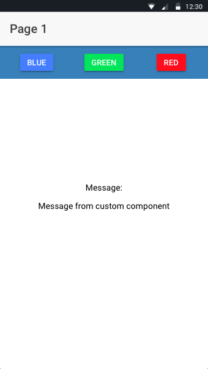 | 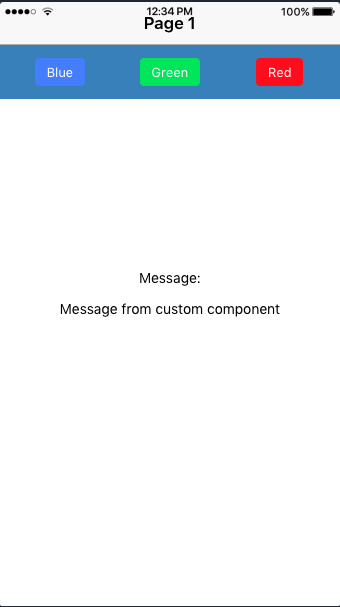
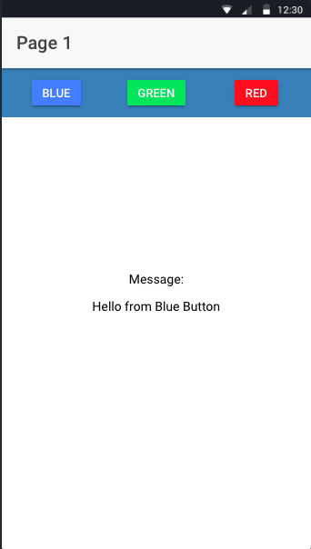 | 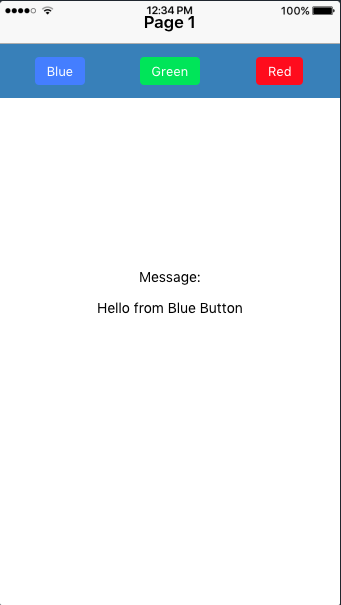
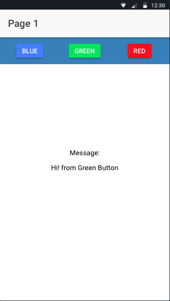 | 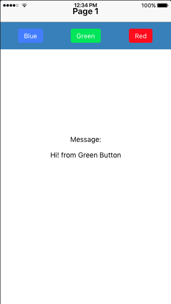


### ListComponent

Android            |  iOS
:-------------------------:|:-------------------------:
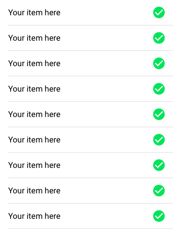  | 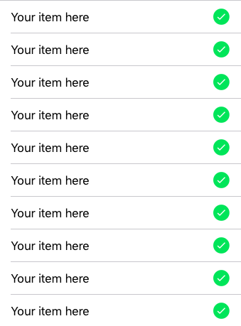

This list render the items that you pass to this component using the @Input decorator.

```typescript
@Component({
  selector: 'MyList',
  templateUrl: 'list.html'
})
export class ListComponent {

  @Input()
  items: [String]

  constructor() {
    console.log('Hello ListComponent Component');
  }

}
```

```html
<div>
    <ion-list>
        <ion-item *ngFor="let item of items">
            {{item}}
          <ion-icon name="checkmark-circle" color="secondary" item-end></ion-icon>
        </ion-item>
    </ion-list>
</div>
```
And in the Parent component (ListPage), you need pass the list data to the custom ListComponent (MyList).

```html
<ion-content>
  <MyList [items]="items"></MyList>
</ion-content>
```

```typescript
@IonicPage()
@Component({
  selector: 'page-list',
  templateUrl: 'list.html',
})
export class ListPage {

  items = Array<String>()

  constructor(public navCtrl: NavController, public navParams: NavParams) {

  }

  ionViewDidLoad() {
    // Default values
    for (let index = 0; index < 10; index++) {
      this.items.push("Your item here");
    }
  }
}
```

This could be useful if you need to use the same list with different data in different pages.

In the ListPage, you can use the MenuComponent to change the content of ListComponent depending on the seleted button.

Android            |  iOS
:-------------------------:|:-------------------------:
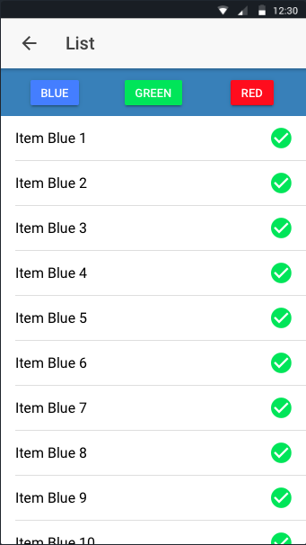  | 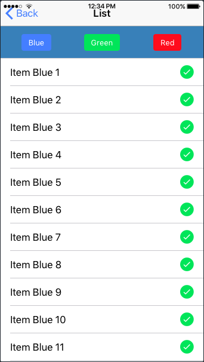
  | 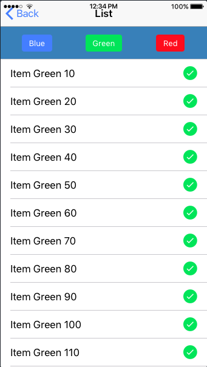
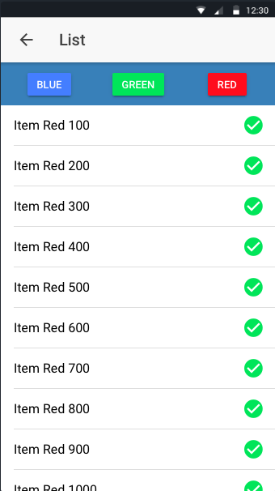  | 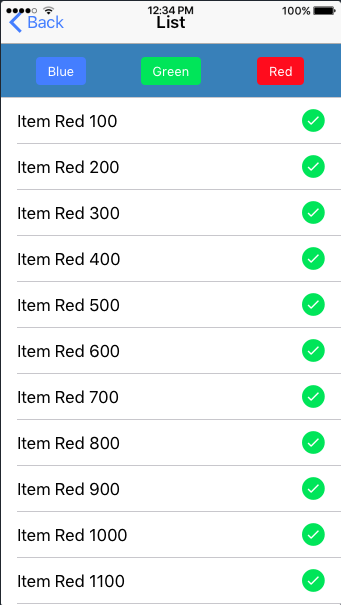
